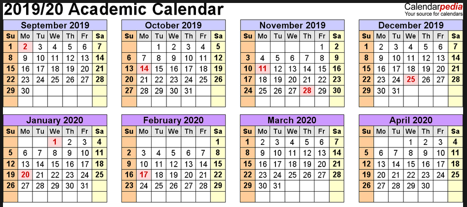

# Calendar of Events

### Fall 2019 - Spring 2020

Overall Plan: Meetings every two weeks, alternating between talks and hack sessions.

### Topics

- Overview + Building a professional website
- Where Physics Ph.D.s work and how to get there
- Faculty and postdoc career panel
- Resumes and CVs (Talk from Career Services)
- Nailing job interiews (Talk from Career Services)
- Proposal / Grant writing
- Networking
- Science Communication (Sara Perdue)
- Data science talk (version control and unit testing)
- Data science talk (misrepresenting data with colors and plots)
- Data science talk (visualization and giving talks)
- Data scinece talk (improving code efficiency)

### Hack ideas

- Build websites
- Update / format CVs
- Google scholar accounts
- Updating LinkedIn
- Photo Day
- Looking for internships

### Resources

- Madpy Meetings